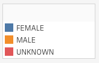
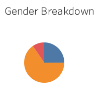
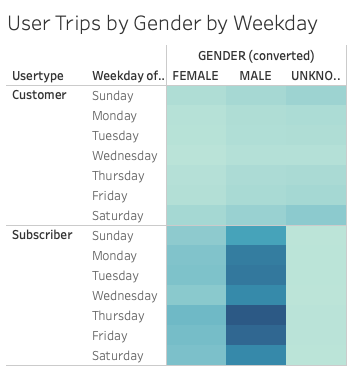
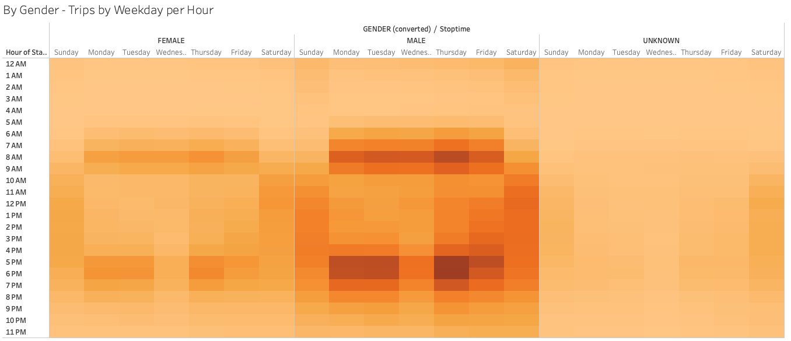
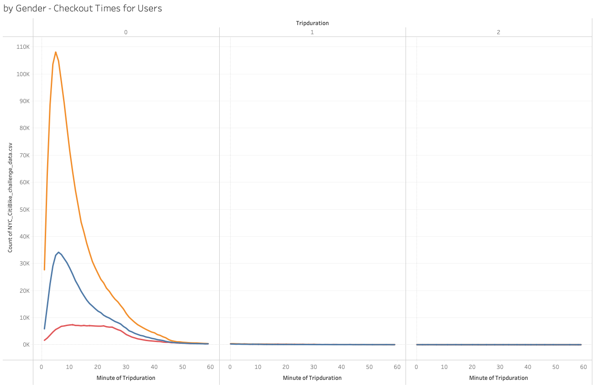
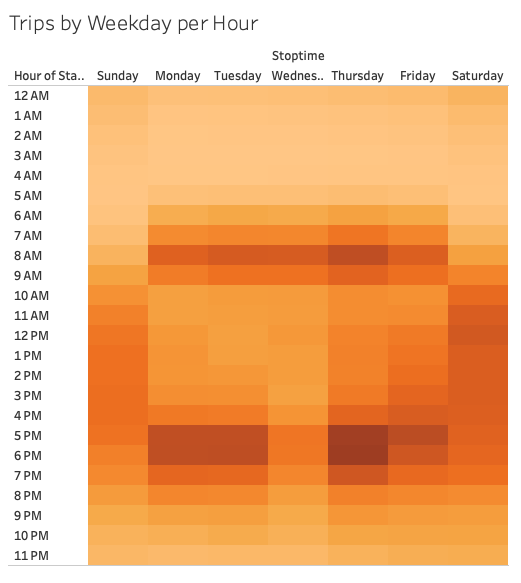
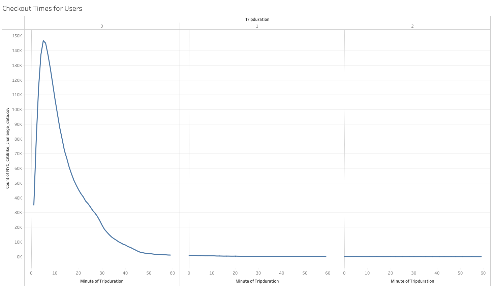

# bikesharing-analysis

## Overview of Analysis
Data from a NYC bike sharing program is being analyzed to help determine if a similar program should be started in Des Moines. 

### Purpose
The purpose of this project is to use the Citi bike data to create visualization in tableau that be used on the Des Moines bike sharing proposal 

## Results

[Tableau Story Link](https://public.tableau.com/app/profile/carly.magiera/viz/citibike_analysis_16532597128890/BikesharingAnalysis)

**Gender Key** 

### Total number of trips

There were 2,344,334 trips taken in the NYC bike sharing program. This high number or trips speaks to the success of the program.

### User Breakdown

The pie chart shows the user breakdown by gender. The largest user group is male.

### Trips by Weekday by User type

The heatmap of trips by weekday by gender by user type shows that male subscribers are the most common type of user across all days of the week. 

### Trips by Weekday by Gender

Trips were broken down by weekday by hour by gender. Males are the most common users at peak hours. 

### Trips by Duration by Gender

Trips were graphed by duration by gender. there is a large gap between the male user group and any other user group. 

### Trips by Weekday per Hour

Trips by weekday per hour were presented in a heat map to show that peak usage of bikes is during work commute hours.

### Bikes Trips by Duration

Graphing trips by trip duration demonstrated that most trips last under one hour. 

## Summary

The results from this story show that the bike program was highly used in NYC. the largest user group was male subscribers, and the bikes were most used on weekdays during rush hour. The bikes were also used steadily throughout the day during weekends. Bike trips are typically under an hour with mostly lasting about 6 minutes.

### Additional Visualizations
An additional visualization that could be down is a line chart plotting trips by trip distance. This could be down by using the starting and stopping trip latitude and longitude. This visualization could be useful for evaluating wear and tear on a bike. 
We can also plot trips by trip duration and user type to look for patterns in traveling time for subscribers compared to regular customers. 
